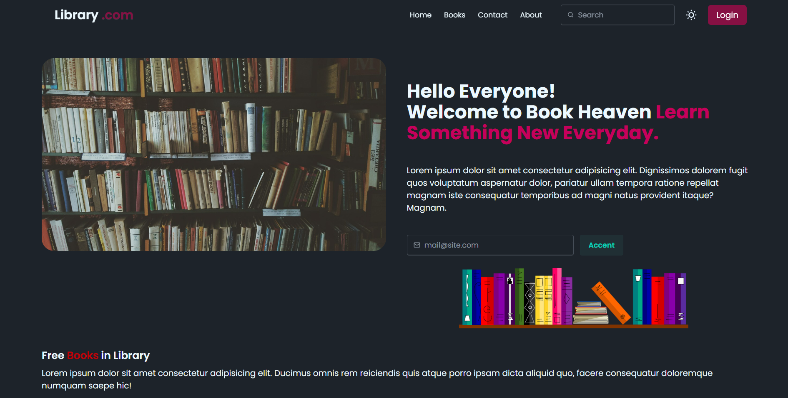
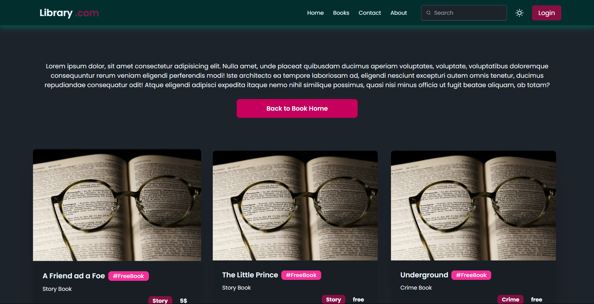
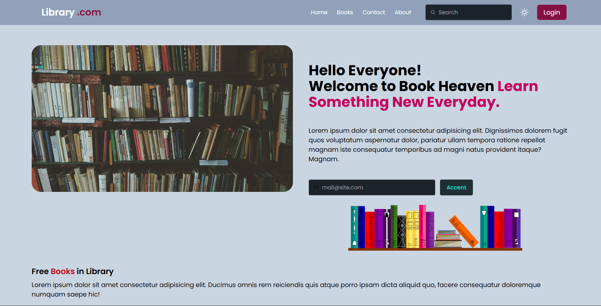
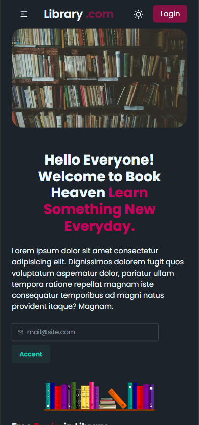

## Wait!!!!  UNDER CONSTRUCTION

# 📚 BookShelf — A Modern Book Discovery Frontend

A beautifully crafted frontend application for book lovers to explore, discover, and organize their favorite reads. Built using **React**, **React Hooks**, **Tailwind CSS**, and **DaisyUI** for rapid UI development and a smooth user experience.

---

## 🔥 Features

- 🧭 Smooth navigation with **React Router**
- 🎨 Elegant and customizable UI powered by **DaisyUI + Tailwind CSS**
- 📱 Responsive design for mobile and desktop
- 🌙 Light/Dark mode toggle (via DaisyUI)

---

## 🚀 Tech Stack

| Tech           | Description                             |
|----------------|-----------------------------------------|
| ⚛️ React        | Component-based frontend framework      |
| 🎣 React Hooks | State and lifecycle management          |
| 💨 Tailwind CSS| Utility-first CSS framework             |
| 🌼 DaisyUI     | UI components built on Tailwind         |
| 🛣 React Router| Client-side routing                     |

---

## 📸 Some Frontend Screenshots






## 🛠️ Installation

```bash
# Clone the repository
git clone https://github.com/your-username/bookshelf-frontend.git
cd bookshelf-frontend

# Install dependencies
npm install

# Start the development server
npm run dev
```
